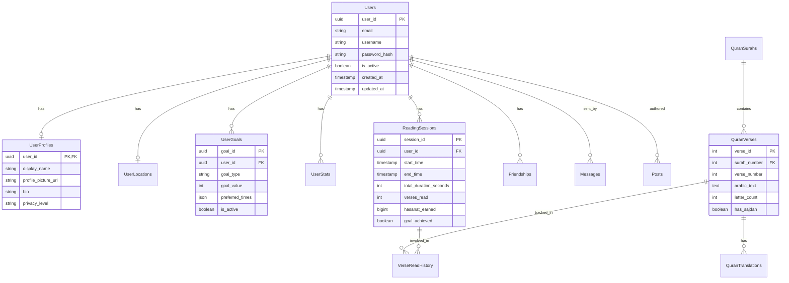

# Entity Relationship Diagram (ERD)

```mermaid
erDiagram
    Users ||--o| UserProfiles : "has"
    Users ||--o| UserLocations : "has"
    Users ||--o{ UserGoals : "has"
    Users ||--o{ UserStats : "has"
    Users ||--o{ ReadingSessions : "has"
    Users ||--o{ Friendships : "has"
    Users ||--o{ Messages : "sent_by"
    Users ||--o{ Posts : "authored"

    QuranSurahs ||--o{ QuranVerses : "contains"
    QuranVerses ||--o{ QuranTranslations : "has"
    QuranVerses ||--o{ VerseReadHistory : "tracked_in"

    ReadingSessions ||--o{ VerseReadHistory : "involved_in"

    Users {
        uuid user_id PK
        string email
        string username
        string password_hash
        boolean is_active
        timestamp created_at
        timestamp updated_at
    }

    UserProfiles {
        uuid user_id PK, FK
        string display_name
        string profile_picture_url
        string bio
        string privacy_level
    }

    UserGoals {
        uuid goal_id PK
        uuid user_id FK
        string goal_type
        int goal_value
        json preferred_times
        boolean is_active
    }

    QuranVerses {
        int verse_id PK
        int surah_number FK
        int verse_number
        text arabic_text
        int letter_count
        boolean has_sajdah
    }

    ReadingSessions {
        uuid session_id PK
        uuid user_id FK
        timestamp start_time
        timestamp end_time
        int total_duration_seconds
        int verses_read
        bigint hasanat_earned
        boolean goal_achieved
    }
```
